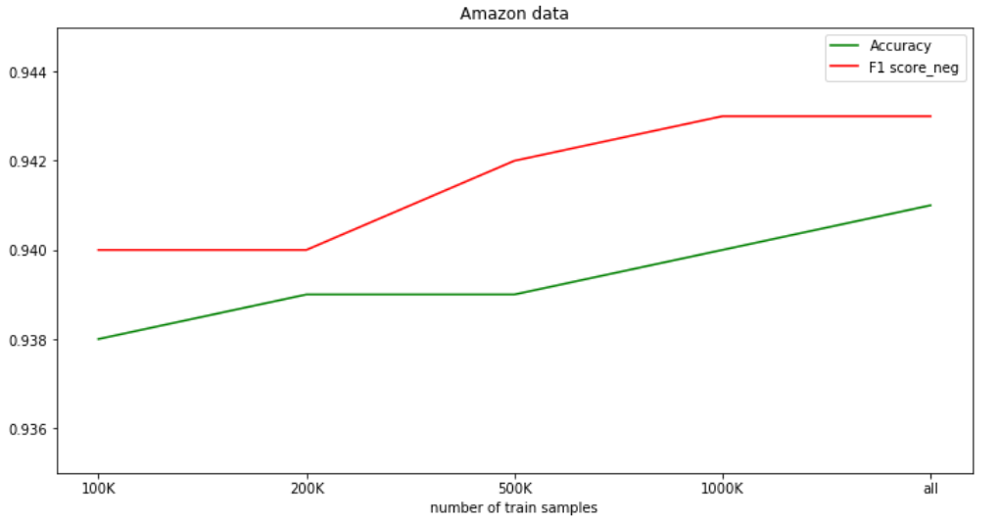
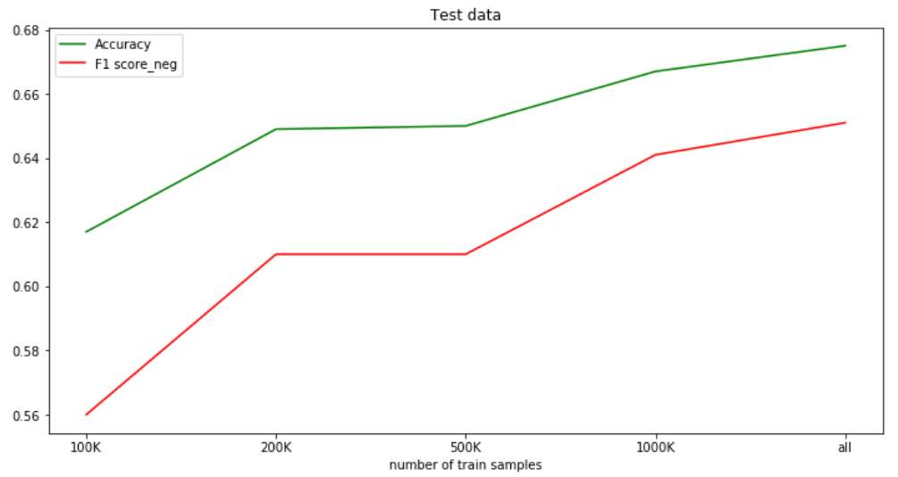
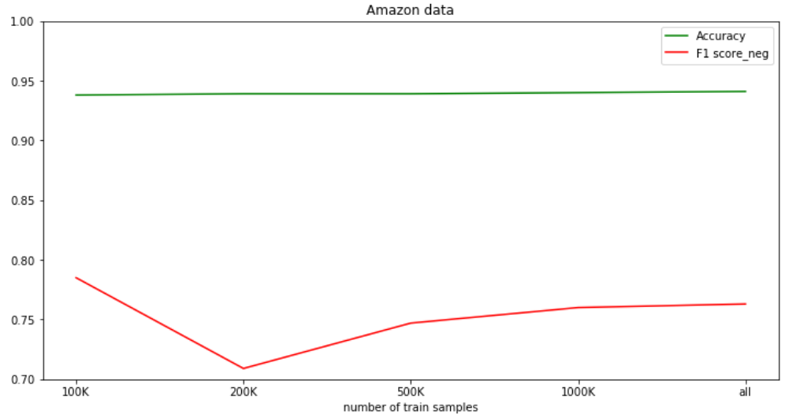
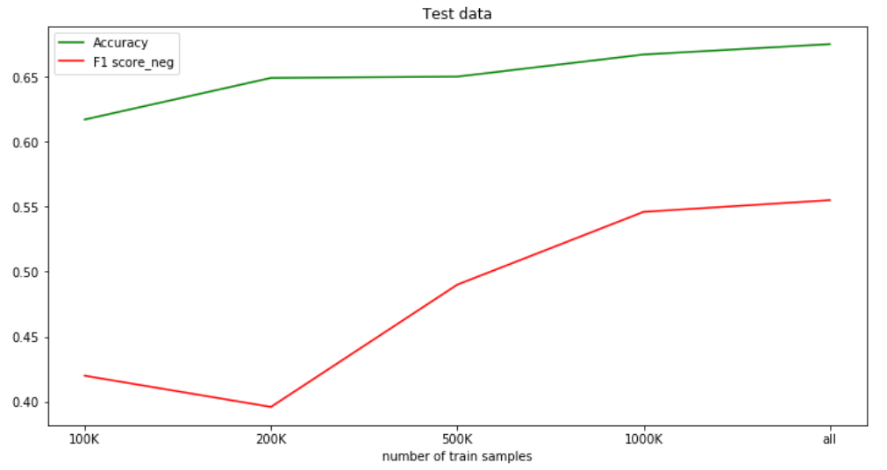
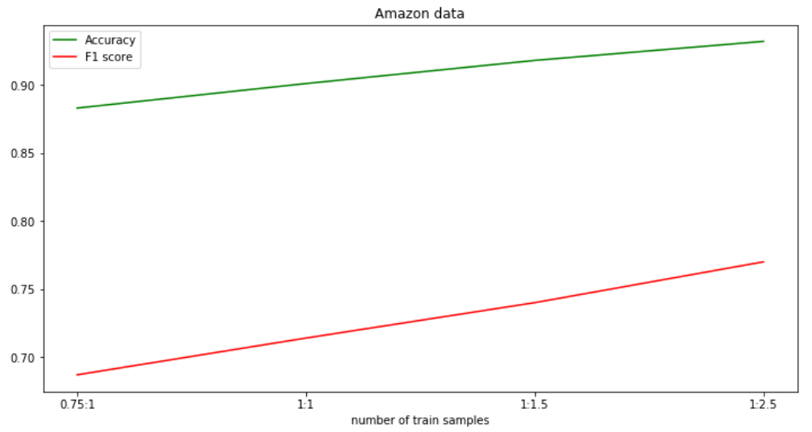
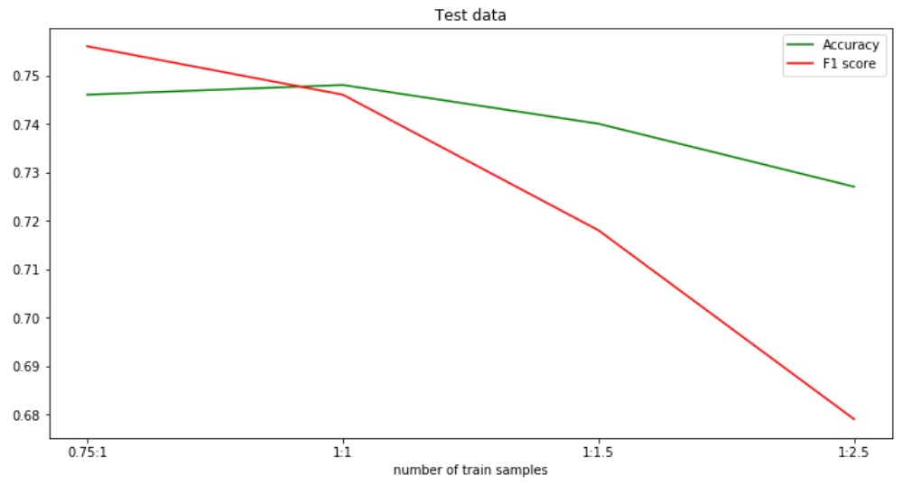

# Team XRAY - Linear models

Based on models from http://scikit-learn.org

## Step 1

### MultinomialNB  

Feature extraction: CountVectorizer(), TfidfTransformer()  
Preprocessing: reg_exp, stop_words  
Results: Validation accuracy on **RT** - **0.80**  

## Step 2

### SGDClassifier [ipynb](https://github.com/udsclub/xray-sentiment-analysis/tree/master/linear_sgdc)  

#### Train/Test stages:

| Step  | Preprocess | val_acc on RT | test_acc on IMDB | val_acc on IMDB | test_acc on RT 
| -- |:------------------ |:-----:|:--------:|:----|:--------:
| 1 | regExp + CountVectorizer() | 0.7823 | 0.8430 | 0.8371 | 0.6910 
| 2 | Step 1 + stop_words='english' | 0.7758 | 0.8320 | 0.8755 | 0.6979
| 3 | Step 2 + ngram_range=(1,2) | 0.7819 | 0.8512 | 0.8883 | 0.6848
| 4 | CountVectorizer() + STOPWORDS + ngram_range=(1,2) | 0.7884 | 0.8236 | 0.8948 | 0.6785
| 5 | Step 3 + STOPWORDS + TfIdfTransformer() | 0.7345 | 0.8295 | 0.9015 | 0.7524
| 6 | Step 5 + TfIdfTransformer(sublinear_tf=True) | 0.7319 | 0.8438 | 0.9059 | 0.7565

STOPWORDS = 'a','an','by','did','does', 'was', 'were', 'i' 

#### Train/Test stages for MIX:

Validation Accuracy

| Step | Preprocess | MIX(RT+IMDB) | RT | IMDB
| ------------- |:------------------|:-----:|:--------:|:----:
| 7 | Step 6 | 0.7770 | 0.7871 |  0.8958

## Step 3

### LinearSVC [ipynb](https://github.com/udsclub/xray-sentiment-analysis/tree/master/linear_svc)  

#### Train/Test stages:

| Step | Preprocess | val_acc on RT | test_acc on IMDB | val_acc on IMDB | test_acc on RT 
| -- |:------------------|:-----:|:--------:|:----:|:--------:
| 1 | CountVectorizer() | 0.76 | 0.81 | 0.86 | 0.68 
| 2 | regExp + CountVectorizer() | 0.76 | 0.81 | 0.86 | 0.68 
| 3 | CountVectorizer(ngram_range=(1, 2)) | 0.7962 | 0.8608 | 0.9081 | 0.7336 
| 4 | Step 3 + STOPWORDS + C=0.4 | 0.7957 | 0.8617 | 0.9070 | 0.7325 
| 5 | Step 3 + STOPWORDS + C=0.04 | 0.8078 | 0.8646 | 0.9083 | 0.7383 
| 6 | Step 6 + regExp | 0.8078 | 0.8638 | 0.9071 | 0.7379 

STOPWORDS = 'a','an','by','did','does', 'was', 'were', 'i' 

#### Train/Test stages for MIX:

Validation Accuracy

| Step | Preprocess | MIX(RT+IMDB) | RT | IMDB
| -- |:------------------|:-----:|:--------:|:----:
| 7 | Step 6 | 0.8365 | 0.8078 | 0.9071

## Step 4

### LogisticRegression [ipynb](https://github.com/udsclub/xray-sentiment-analysis/tree/master/logistic%20regression%20final)  

| Step | Preprocess | RT+IMDB | RT | IMDB
| -- |:------------------|:-----:|:--------:|:----|
| 1 | Baseline(countvectorizer) | 0.82 | 0.72 | 0.89
| 2 | Data cleaning, stopwords, stemming | 0.81 | 0.78 | 0.88
| 3 | Step 2 + Hashing vectorizer | 0.82 | 0.78| 0.89
| 4 | Step 1 + Step 2 + POS tags | 0.81 | 0.77 | 0.88
| 5 | Step 1 + Step 2 + Tfidf transformer + bigrams | 0.83 | 0.80 | 0.90
| 6 | Step 1 + Step 2 + Grid search parameters | 0.84 | 0.79 | 0.85
| 7 | Step 2 + Tfidfvectorizer+bigrams | 0.84 | 0.80 | 0.91

## Step 5

### LogisticRegression [ipynb](https://github.com/udsclub/xray-sentiment-analysis/tree/master/logistic%20regression%20final/Amazon%20Movies%20and%20TV)  
** Amazon Movies and TV (1.3M reviews) **

### Results on the same domain

Data size | Amazon train Acc | Amazon test Acc | Amazon test F1 | Movie reviews Acc | Movie reviews F1 | Amazon test F1_neg | Movie reviews F1_neg
:-------:|:------:|:--:|:--:|:--:|:--:|:--:|:--:
100K   | 0.941 | 0.938 | 0.940 | 0.617 | 0.560 | 0.785 | 0.420 
200K   | 0.949 | 0.939 | 0.940 | 0.649 | 0.610 | 0.709 | 0.396 
500K   | 0.939 | 0.939 | 0.942 | 0.650 | 0.610 | 0.747 | 0.490 
1000K  | 0.938 | 0.940 | 0.940 | 0.667 | 0.640 | 0.760 | 0.546 
All    | 0.939 | 0.941 | 0.940 | 0.675 | 0.670 | 0.763 | 0.555 
380K (balanced data) | 0.89 | 0.899 | 0.900 | 0.750 | 0.740 | 0.752 | 0.567 

---

---

### Results on another domains

Model Parameters: 
    + Hashing Vectorizer 
    + n_gram range = (1, 3) 
    + reg exp 
    + stop words from Snowball Stemmer 
    + train set is balanced
    
F1 score was calculated for negative reviews (` f1_score(pos_label = 0)`)

### Trained on balanced data (380K reviews)

| Domain | Test Accuracy | F1 score
|:--------|:-----:|:----:
| Digital music | 0.895 | 0.620
| Office products | 0.747 | 0.585
| Video games | 0.840 | 0.606

### Trained on all data (1.3M reviews)

| Domain | Test Accuracy | F1 score
|:--------|:-----:|:----:
| Digital music | 0.947 | 0.650
| Office products | 0.928 | 0.615
| Video games | 0.915 | 0.666

